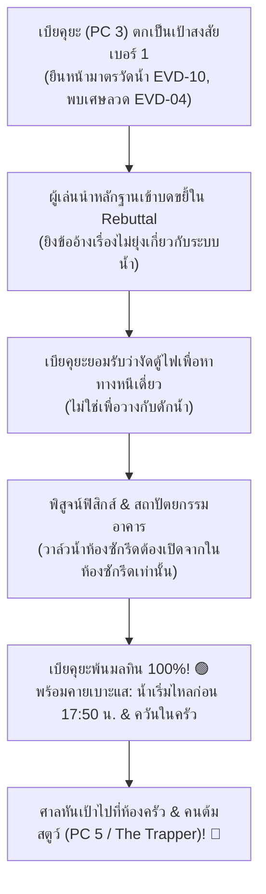

# 🕶️ คู่มือสวมบทบาท NPC เบียคุยะ โทกามิ (PC 3) ฉบับ DM
*(Byakuya Togami - The Red Herring & Prime Suspect Guide for 4-PC Session)*
*(Scenario: คดีสตูว์มรณะแห่งความสิ้นหวัง - Despair Stew & The Counter-Hanging Mystery)*

---

## 📌 1. ภาพรวมบทบาทและกลยุทธ์ของ DM (Master Concept & Session Dynamics)

### ทำไมต้องมีเบียคุยะเป็น NPC ตัวที่ 5 ในเซสชันผู้เล่น 4 คน?
1. **รักษาความสมดุลและความคลาสสิกของ Danganronpa:** ในกลุ่มผู้เล่น 4 คน หากไม่มีตัวละครอื่นเลย ผู้ต้องสงสัยจะแคบเกินไป (ตัดตัวเลือกเร็วเกินไป) การมี **เบียคุยะ (PC 3)** มาเป็น **"ผู้ต้องสงสัยเบอร์ 1 (แพะรับบาป / Prime Red Herring)"** จะดึงดูดความสนใจและความสงสัยของศาลในช่วงต้น ทำให้คนร้ายตัวจริง (The Trapper) มีพื้นที่ในการเล่น Saboteur และโกหกได้อย่างเป็นธรรมชาติ
2. **รักษาเนื้อหาและแท่นยืนในศาลครบ 5 แท่น:** กระดานศาล, หน้าจอโปรเจกเตอร์ Court, และมินิเกมต่างๆ (เช่น Debate Scrum แบ่ง 2 vs 2 หรือ 3 vs 2, Logic Dive, Voting Time) จะทำงานได้อย่างสมบูรณ์แบบ
3. **คุมเวลาเซสชัน 6 ชั่วโมงได้อย่างแม่นยำ:** การมีจังหวะ "ล่าแพะรับบาป -> จับไต๋ -> หลุดพ้นจากข้อสงสัย -> พลิกเป้าไปหาคนร้ายตัวจริง" จะช่วยแบ่งช่วงการถกเถียงในศาลออกเป็น 2 ช่วงใหญ่ที่เข้มข้นและน่าติดตามตลอด 1.5 - 2 ชั่วโมงเต็มในศาล

---

### ตารางกระจายบทบาทสำหรับเซสชัน 4 PC

| ผู้เล่น | บทบาทที่ได้รับ | ข้อมูล Handout ลับ | หน้าที่ในเกม |
| :---: | :---: | :---: | :--- |
| **Player 1** | **Custom PC (Slot 1)** | Handout PC 1 (พยานตู้กดน้ำ / บอร์ด) | พยานปากสำคัญเรื่องเสียงน้ำไหลในแนวกำแพง และเห็นคนในครัว |
| **Player 2** | **Custom PC (Slot 2)** | Handout PC 2 (พยานโรงยิม / รอยหยดน้ำ) | สำรวจโรงยิม พบไฟกะพริบ และพบซากถังน้ำแตกที่ลานปูน |
| **Player 3** | **Custom PC (Slot 4)** | Handout PC 4 (พยานทางเดินกระจก) | เห็นเงาถังน้ำห้อยนอกหน้าต่างตอน 18:00 น. และชิมรสสตูว์ |
| **Player 4** | **Custom PC (Slot 5)** | Handout PC 5 (**The Trapper / Blackened**) | **คนร้ายตัวจริง!** ต้มสตูว์ทำลายหลักฐาน วางกับดักน้ำ ใช้ Saboteur Panel |
| **DM (NPC)** | **เบียคุยะ โทกามิ (Slot 3)** | Handout PC 3 (ฉบับปรับปรุงให้น่าสงสัย) | **ผู้ต้องสงสัยเบอร์ 1 (แพะรับบาป)** แอบงัดระบบไฟ/น้ำ ปากแข็ง จนมุม และคายเบาะแสพลิกคดี |

---

### ตารางบริหารเวลาเซสชัน 6 ชั่วโมง (Master Pacing Flow)

```text
[0:00 - 1:00] ชั่วโมงที่ 1: แนะนำตัวละคร Custom PC, กฎโรงเรียน Monokuma, ประหาร Daiki (NPC 1)
[1:00 - 2:00] ชั่วโมงที่ 2: สำรวจหาทางออก 3 เส้นทาง (AP System 2d6), พบเรียวตะที่ห้องซักรีด
[2:00 - 3:00] ชั่วโมงที่ 3: แจกแรงจูงใจ (Motive), แจก Handout ลับ, มื้อค่ำสตูว์รวมตัว, สร้าง Alibi
[3:00 - 4:00] ชั่วโมงที่ 4: 21:00 น. เสียงถังตกกระแทก, พบศพเรียวตะ, สืบสวนคดี (Investigation Phase)
[4:00 - 5:00] ชั่วโมงที่ 5: ศาลชั้นเรียนครึ่งแรก (Class Trial Part 1) - ล่าแพะรับบาปเบียคุยะ (Stage 0 - 3)
[5:00 - 6:00] ชั่วโมงที่ 6: ศาลชั้นเรียนครึ่งหลัง (Part 2) - จับคนร้ายในครัว, ทริก Stopper Knot, โหวต & บทสรุป
```

---

## 🕵️‍♂️ 2. พฤติกรรมน่าสงสัย & เบาะแสที่ชี้เป้ามาที่เบียคุยะ

เบียคุยะถูกออกแบบมาให้มี **"พฤติกรรมและหลักฐานมัดตัว"** ที่ทำให้ผู้เล่นทุกคนรุมชี้หน้าสงสัยว่าเป็นคนวางกับดักน้ำ:

### 1. พฤติกรรมน่าสงสัยในช่วงก่อนเกิดเหตุ (17:30 - 21:00 น.)
- **ท่าทีปลีกตัวและหยิ่งผยอง:** ปฏิเสธการร่วมมือกับใคร อ้างว่า *"การเกาะกลุ่มของคนโง่มีแต่จะพากันไปตาย"*
- **ป้วนเปี้ยนตรงจุดยุทธศาสตร์ของระบบอาคาร:** ตลอดช่วง 17:30 - 18:15 น. มีคนเห็นเบียคุยะยืนอยู่หน้า **ประตูเหล็กยักษ์ (Blast Gate)** และ **ตู้ควบคุมวาล์วน้ำหลัก** บริเวณโถงทางเข้า
- **แอบพกอุปกรณ์น่าสงสัย:** มีคลิปหนีบกระดาษเหล็กดัดงอและลวดเส้นเล็กตกอยู่บริเวณที่เขายืน (`EVD-04`) ส่อเจตนาว่าแอบงัดแงะตู้ควบคุม
- **ไม่ยอมกินสตูว์ตอนมื้อค่ำ:** เมื่อถึงเวลามื้อค่ำ 19:00 น. เบียคุยะตักสตูว์เพียงคำเดียวแล้ววางช้อน อ้างว่า *"รสชาติชั้นต่ำ ไม่คู่ควรกับลิ้นของทายาทโทกามิ"* (ทำให้เพื่อนสงสัยว่าเขารู้ล่วงหน้าหรือไม่ว่าสตูว์มีสิ่งผิดปกติ!)

### 2. หลักฐานในที่เกิดเหตุที่โยงมาที่เบียคุยะ
- `EVD-10` **มาตรวัดน้ำประปาหลัก (Water Meter):** ตั้งอยู่ข้าง Blast Gate โถงทางเข้าหน้าจุดที่เบียคุยะยืนอยู่ตลอดช่วงเย็น ตัวเลขแสดง 65.2 ลิตร และเข็มยังหมุนอยู่ ทุกคนจะคิดว่าเบียคุยะคือคนปรับตั้งอัตราน้ำไหล!
- `EVD-24` **แผนผังอาคารบนบอร์ดประชาสัมพันธ์:** ข้างจุดที่เบียคุยะยืน มีรอยเหรียญขูดสติกเกอร์ปิดทับแผนผัง
- `EVD-04` **คลิปหนีบกระดาษเหล็ก:** ตกอยู่หน้าตู้ไฟข้าง Blast Gate

---

## 🎭 3. สคริปต์ไดอะล็อกพร้อมใช้สำหรับ DM (Trial Dialogue Scripts)

DM สามารถนำบทพูดเหล่านี้ไปใช้พูดโต้ตอบในศาลได้ทันทีตามแต่ละสเตจ:

---

### บทพูดช่วงที่ 1: วางมาดหยิ่งยะโส & ปัดข้อกล่าวหา (Non-Stop Debate)

> **สถานการณ์:** ผู้เล่นเริ่มเปิดประเด็นว่าพบศพเรียวตะถูกแขวนคอด้วยกลไกน้ำหนักน้ำ และพบว่ามาตรวัดน้ำ (`EVD-10`) อยู่ตรงโถงทางเข้าหน้าจุดที่เบียคุยะยืน

* **เบียคุยะ (กอดอก ยิ้มเหยียด):**  
  *"หึ... น่าสมเพชจริงๆ พอคิดอะไรไม่ออกก็เริ่มพาลชี้หน้าคนอื่นงั้นเรอะ? ฉันจะไปยืนตรงโถงทางเข้าแล้วมันเกี่ยวอะไรกับการตายของเจ้าสวะเรียวตะนั่นกัน?"*

* **เบียคุยะ (ตอนถูกถามเรื่องคลิปหนีบกระดาษและตู้ไฟ):**  
  *"คลิปหนีบกระดาษงั้นเหรอ? ขยะพรรค์นั้นโรงเรียนเฮงซวยนี่คงมีเกลื่อนกลาดอยู่แล้ว คิดว่าคนระดับฉันจะลดตัวไปแตะต้องเศษเหล็กแบบนั้นรึไง? อย่าเอาตรรกะระดับอนุบาลมาปรักปรำฉันหน่อยเลย!"*

* **เบียคุยะ (คำพูดจุดอ่อนสีส้มใน Non-Stop Debate ให้ผู้เล่นยิงแย้ง):**  
  > *"ทั้งบ่ายฉันยืนสำรวจความปลอดภัยของประตูกล Blast Gate เท่านั้น **ไม่มีเหตุผลอะไรที่ฉันจะต้องไปยุ่งเกี่ยวกับระบบน้ำประปาของโรงเรียนเลยแม้แต่น้อย!**"*  
  > *(จุดแย้ง: ยิงด้วย `EVD-10` มาตรวัดน้ำ หรือ คำให้การว่าเห็นเขางัดตู้ข้างมาตรวัดน้ำ!)*

---

### บทพูดช่วงที่ 2: ดวลคารมเดือด (Rebuttal Showdown กับผู้เล่น)

> **สถานการณ์:** ผู้เล่นคนหนึ่ง (เช่น PC 1 หรือ PC 2) ลุกขึ้นชี้หน้ากล่าวหาว่าเบียคุยะโกหก และขอเปิดฉากดวลคารม Rebuttal Showdown

* **เบียคุยะ (สะบัดแว่น โน้มตัวกดดัน):**  
  *"คิดว่าเสียงดังแล้วจะกลายเป็นความจริงงั้นเรอะ?! ไร้สาระสิ้นดี! มาตรวัดน้ำมันก็แค่เครื่องบอกปริมาณการใช้น้ำของคนทั้งตึก ถ้าฉันเป็นคนวางกับดักจริง ป่านนี้ฉันคงแอบเปิดน้ำท่วมโรงเรียนไปแล้ว ไม่มาเสียเวลานั่งรอหยดละ 0.4 ลิตรบ้าบอนั่นหรอก!"*

* **เบียคุยะ (คำพูดเถียงในดาบที่ 2):**  
  *"ถ้าฉันจะฆ่าเรียวตะจริง ฉันเดินไปบิดคอเจ้านั่นตรงๆ ยังจะง่ายกว่ามานั่งคำนวณมวลน้ำ 65.2 กิโลกรัมให้ปวดหัว! พวกแกมีหลักฐานอะไรมายืนยันว่าฉันเป็นคนเปิดก๊อกน้ำในห้องซักรีดกันฮะ?!"*

---

### บทพูดช่วงที่ 3: จนมุม & หลุดฟอร์ม (Cornered & Breakdown)

> **สถานการณ์:** ผู้เล่นต้อนเบียคุยะด้วยข้อเท็จจริงว่า เขาไม่ยอมบอกว่าทำอะไรกันแน่ช่วง 18:00 น. และทำไมถึงมีรอยขูดที่ตู้ไฟ

* **เบียคุยะ (เริ่มเหงื่อตก กัดฟันแน่น):**  
  *"ชิ... พวกแกนี่มันกัดไม่ปล่อยจริงๆ...!"*

* **เบียคุยะ (สารภาพความจริง):**  
  *"เออ! ยอมรับก็ได้ว่าฉันแอบไปงัดตู้ควบคุมไฟตรงนั้น! แต่ที่ฉันทำ ไม่ใช่เพราะจะไปฆ่าไอ้เจ้าเรียวตะนั่นสักหน่อย! ฉันแค่พยายามจะตัดวงจรไฟฟ้าแรงสูงของประตูกล Blast Gate เพื่อจะหาทางหนีออกไปจากนรกนี่คนเดียวต่างหากเล่า! พอใจพวกแกรึยัง?!"*

---

### บทพูดช่วงที่ 4: พลิกคดี & ชี้เป้าสู่คนร้ายตัวจริง (Acquittal & Turning Point)

> **สถานการณ์:** เมื่อความจริงเรื่องตู้ไฟกระจ่าง เบียคุยะจะคายข้อมูลสำคัญที่สังเกตเห็นในช่วงเกิดเหตุ ซึ่งจะหักเหศาลกลับไปที่ห้องครัวและห้องซักรีด

* **เบียคุยะ (ปรับแว่นกลับเข้าที่ น้ำเสียงจริงจัง):**  
  *"หึ ในเมื่อพวกแกฉลาดพอที่จะรู้ว่าฉันไม่ใช่คนร้าย งั้นฉันจะบอกข้อมูลเด็ดให้เอาบุญ... ตอนที่ฉันยืนเฝ้ามาตรวัดน้ำช่วง 17:50 ถึง 18:00 น. ก่อนที่ฉันจะลงมืองัดตู้ เข็มของมาตรวัดน้ำ **มันเริ่มหมุนอยู่ก่อนแล้วเฟ้ย!**"*

* **เบียคุยะ (ชี้เป้าคนร้าย):**  
  *"นั่นแปลว่ามีใครบางคนเข้าไปเปิดวาล์วน้ำในห้องซักรีดตั้งแต่ก่อน 17:50 น. แล้ว! และในจังหวะนั้น ตอนที่ฉันมองข้ามโถงทางเดินไป ฉันเห็นชัดเจนว่ามีควันไฟและกลิ่นอาหารลอยพวยพุ่งออกมาจากห้องครัว... ในหมู่พวกแก 4 คน ใครกันแน่ที่ขลุกอยู่ในครัวตอนนั้น?!"*

---

## ⚖️ 4. จุดจับไต๋ & ขั้นตอนการหลุดพ้นจากข้อสงสัย (Step-by-Step Acquittal Flow)

DM สามารถดำเนินเรื่องตาม 3 ขั้นตอนนี้เพื่อให้ผู้เล่นรู้สึกพึงพอใจในการไขปริศนา:



### สรุป 3 ข้อเท็จจริงที่ช่วยให้เบียคุยะพ้นมลทิน
1. **ระบบท่อประปาแยกส่วน (Piping Layout):** ตู้ควบคุมโถงหน้าเป็นเพียง "มาตรวัดรวม" ไม่มีวาล์วหรี่น้ำแยกเฉพาะจุด การจะหรี่น้ำ 0.40 ลิตร/นาที ต้องเข้าไปหมุนวาล์วก๊อกน้ำในห้องซักรีดโดยตรง ซึ่งเบียคุยะไม่เคยเหยียบเข้าไปในห้องซักรีดเลย
2. **พยานสายตายืนยันตำแหน่ง (Alibi from PC 4):** ผู้เล่น PC 4 ยืนยันว่าเห็นเบียคุยะยืนอยู่ที่โถงหน้าช่วง 18:00 น. จริง ตรงกับเวลาที่เงาถังน้ำถูกผูกอยู่นอกหน้าต่างห้องซักรีดแล้ว แสดงว่าคนผูกถังต้องเป็นคนอื่น
3. **เข็มวัดน้ำหมุนล่วงหน้า:** เข็มวัดเริ่มหมุนตั้งแต่ช่วง 17:45 น. ซึ่งเป็นช่วงที่เบียคุยะเพิ่งเดินออกจากห้องนอน

---

## 📱 5. คู่มือเชิงเทคนิค: การเปิดแท็บผู้เล่นที่ 5 สำหรับ DM (Technical Setup Guide)

เพื่อให้หน้าจอโปรเจกเตอร์ศาล (Court Screen) แสดงแท่นยืนของเบียคุยะครบ 5 แท่น และสามารถร่วมกิจกรรมศาลได้ ให้ DM ทำตามขั้นตอนดังนี้:

### ขั้นตอนการเตรียมเครื่อง & ล็อกอินแท็บที่ 2
1. **หน้าจอหลักของ DM (จอที่ 1):** เปิดหน้าจอ **DM Admin Monitor** (`/play?view=admin`) ตามปกติ
2. **หน้าจอที่สองของ DM (จอที่ 2 หรือ แท็บ Incognito / มือถืออีกเครื่อง):**
   - เข้าเว็บที่ URL ห้องเล่น เช่น `http://localhost:3000/play?room=XXXXXX`
   - ตั้งชื่อผู้เล่น: **`เบียคุยะ โทกามิ`**
   - เลือกตัวละคร / พรีเซ็ต: **`PC 3`** (หรือเลือกอวาตาร์คุณชายแว่นสูทดำ)
   - กดปุ่ม **"เข้าร่วมศาล"**
3. **ตรวจสอบหน้าจอ Court (จอโปรเจกเตอร์):**
   - จะเห็นโพเดียมที่นั่งครบ 5 แท่น (PC 1, 2, 3, 4, 5) มีชื่อ เบียคุยะ โทกามิ ขึ้นบนป้ายชื่อ พร้อมหัวใจ 5/5 ดวง

### การควบคุมมินิเกมในศาลผ่านแท็บเบียคุยะ
- **Stage 0 Non-Stop Debate:** ใช้แท็บเบียคุยะกดปุ่มส่งข้อความ หรือ DM พูดเสียงสดในห้อง แล้วกดปุ่มลด Credibility ของเบียคุยะบนหน้าจอ Admin เมื่อเบียคุยะถูกผู้เล่นแย้งถูกจุด
- **Stage 3 Rebuttal Showdown:** เมื่อผู้เล่นท้าดวลเบียคุยะ DM สามารถกดคำสั่งในหน้า Admin เพื่อเริ่มการดวล และให้เบียคุยะเป็นฝ่ายคู่กรณี
- **Stage 5 Debate Scrum:** ในช่วงแบ่งฝ่าย ให้เบียคุยะยืนอยู่ฝั่งตรงข้ามกับผู้เล่นส่วนใหญ่ (เช่น ยืนยันว่าเวลาตายคือ 18:00 น.) เพื่อสร้างความท้าทายในการผลักเกจชักเย่อ (Tug of War)
- **Stage 8 Voting Time:** ใช้แท็บเบียคุยะกดโหวตไปยังบุคคลที่เขาสงสัย (หรือโหวตคนร้ายตัวจริงเมื่อคดีคลี่คลายแล้ว) เพื่อให้ระบบนับคะแนนโหวตครบ 5 เสียงสมบูรณ์แบบ!

---

*เอกสารฉบับนี้จัดทำขึ้นเพื่อใช้คู่กับ [01_DM_Scenario_Flow.md](file:///c:/Antigravity/Danganronpa-TTRPG/01_DM_Scenario_Flow.md) และ [02_Character_Sheets_and_Handouts.md](file:///c:/Antigravity/Danganronpa-TTRPG/02_Character_Sheets_and_Handouts.md)*
